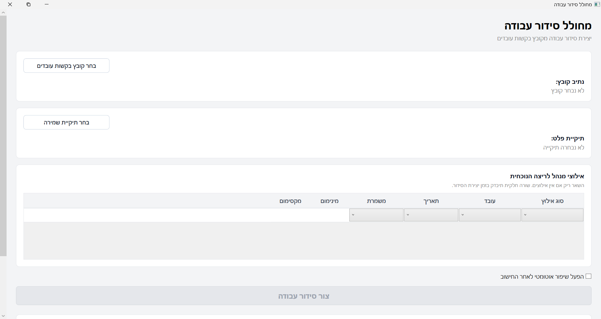

# Aether.TaskProcessor

**Production employee scheduling optimizer built with C# / .NET 8**

Aether.TaskProcessor is a real-world employee scheduling system built to help an operations manager generate bi-weekly work schedules from Excel worker-request files.

The system reads worker availability and shift preferences from XLSX workbooks, applies manager-defined constraints, runs a custom scheduling optimization flow, and exports a clean right-to-left Excel schedule ready for manager review.

This repository is shared as a portfolio-grade public source release. Sensitive names and production data were anonymized or removed.

---

## The Problem

Manual employee scheduling is a difficult combinatorial problem.

A manager has to balance:

- worker availability
- worker shift requests
- fair workload distribution
- morning, afternoon, night, and weekend shifts
- capacity requirements per shift
- operational manager constraints
- hard rules such as avoiding unavailable workers, double-booking, and invalid staffing

Before this system, preparing one bi-weekly schedule could take up to **5 working days** of manual review, negotiation, and repeated Excel edits.

---

## The Solution

Aether.TaskProcessor turns that manual process into a local desktop workflow.

The manager can:

1. Open the Windows desktop app.
2. Select the worker-request XLSX workbook.
3. Select an output folder.
4. Optionally enter manager constraints.
5. Generate a schedule.
6. Open the generated XLSX schedule directly in Excel.

The current production workflow reduced schedule preparation from approximately **5 working days** to about **1 hour**.

---

## Current Production Status

This is not a toy project or a mock demo.

- **Primary user:** operations manager
- **Usage:** recurring bi-weekly employee scheduling
- **Generated so far:** 3 real production schedules
- **Current validated workload:** 19 workers
- **Schedule period:** 14 days
- **Shift types:** morning, afternoon, night
- **Includes:** weekend scheduling dynamics
- **Output:** manager-readable RTL Excel workbook

The system is designed around variable worker counts and schedule inputs. The current real-world validated scenario uses 19 workers over a 14-day period.

---

## Screenshots

### Manager-Facing WPF Desktop App

A localized Hebrew desktop shell for selecting the worker-request workbook, adding manager constraints, generating a schedule, and opening the output.



### Schedule Generation In Progress

The app disables run controls and shows a clear Hebrew running state while the scheduling optimizer works in the background.


> The generated XLSX output is intentionally not shown here because real production schedules may contain employee names and operational details.

---

## Key Features

### Real Excel Scheduling Input

Aether reads worker-request XLSX workbooks and turns availability, shift selections, and scheduling preferences into structured scheduling input.

The manager continues working with Excel, while the system converts the workbook into a clean optimization model.

### Manager Constraint System

The manager can add operational constraints before schedule generation.

Supported constraint types:

- **Forbid assignment** — block a worker from a specific shift
- **Avoid assignment** — discourage assigning a worker to a specific shift
- **Shift capacity override** — change the required staffing count for a specific shift

All manager constraints go through the same validation flow before optimization begins.

### Domain-Driven Scheduling Rules

The scheduling rules are owned by the Domain layer, not by the UI or the optimizer.

The engine evaluates both hard rules and soft trade-offs.

Examples of hard rules:

- avoid assigning unavailable workers
- prevent overlapping assignments
- respect shift staffing requirements
- reject invalid resources or shifts

Examples of soft trade-offs:

- workload balance
- preferred shift fulfillment
- avoid-request burden
- night and weekend distribution pressure

### Genetic Scheduling Optimizer

The system uses a custom genetic scheduling optimizer to search through many possible schedule candidates.

Each candidate is evaluated by the same Domain evaluator and scoring policy, keeping business rules outside the optimization algorithm itself.

### Post-Run Local Improvement

After the genetic optimizer returns a candidate, Aether can run a deterministic local improvement pass.

This pass checks whether legal add moves can improve the evaluated result without creating hard violations.

In the current demo scenario, this reduced the total penalty while preserving a feasible schedule with zero hard violations.

### Explainability Diagnostics

The system includes diagnostics that help explain why a schedule looks the way it does.

Diagnostics can show:

- under-target workers
- over-target workers
- rejected add moves
- score-improving opportunities
- hard-constraint blockers
- whether post-run improvement exhausted simple score-improving add moves

This makes the optimizer easier to trust and debug.

### Manager-Ready XLSX Output

The generated schedule is exported as a right-to-left Excel workbook built for manager review.

The output includes:

- Hebrew labels
- compact date headers
- morning, afternoon, and night blocks
- operational time rows
- readable spacing and borders
- manager-friendly empty cells
- Excel-ready output for review and distribution

### Hebrew WPF Desktop Experience

The WPF app is a thin local desktop shell for the manager.

It supports:

- selecting the worker-request workbook
- selecting the output folder
- entering manager constraints
- showing Hebrew status and failure messages
- keeping the UI responsive during generation
- opening the generated XLSX schedule

### Zero-Install Windows Handoff

The WPF app can be published as a self-contained single-file Windows executable.

The manager does not need:

- .NET SDK
- Visual Studio
- command line knowledge
- API server
- cloud deployment
- source code access

The manager receives one `.exe`, opens it, selects the input workbook, and generates the schedule locally.

### Broad Automated Test Coverage

The repository includes `xUnit` coverage across the main system boundaries:

- Domain scheduling rules
- scoring and ranking
- manager constraint validation
- worker-request import
- optimization behavior
- post-run local improvement
- diagnostics
- XLSX export
- local generation runner
- WPF contract tests
- single-file publish safety checks

## Architecture

The project follows Clean Architecture principles.

The important boundary is that the domain owns the scheduling rules and evaluation. The optimization algorithm searches for candidates, but it does not own the business rules.

```text
src/
├── Aether.Domain
│   └── Scheduling models, rules, scoring, and evaluation
│
├── Aether.Application
│   └── Use cases, scheduling orchestration, manager constraints,
│       optimization flow, diagnostics, and report projections
│
├── Aether.Infrastructure
│   └── XLSX import/export, local file orchestration,
│       repositories, queues, and technical adapters
│
├── Aether.Console
│   └── Console runner and demo/diagnostic commands
│
└── Aether.WpfApp
    └── Thin manager-facing Windows desktop shell
```

---

## Scheduling Flow

```text
Worker-request XLSX
        ↓
XLSX input reader
        ↓
Availability / request importer
        ↓
Manager constraints
        ↓
SchedulingProblem
        ↓
Domain evaluator and scoring
        ↓
Genetic scheduling optimizer
        ↓
Post-run local improvement
        ↓
Schedule projection
        ↓
CSV / XLSX / diagnostics output
        ↓
Manager-readable Excel schedule
```

---

## Layer Responsibilities

### Domain

The Domain layer is the source of truth for scheduling rules.

It contains models such as:

- `SchedulePeriod`
- `SchedulingProblem`
- `Resource`
- `Shift`
- `AvailabilityWindow`
- `Assignment`
- `ScheduleCandidate`
- `ScheduleEvaluationResult`
- `ScheduleScore`

It also owns evaluation concepts such as:

- constraint violations
- scoring weights
- hard and soft violation calculation
- result ranking
- shift sequence classification
- workload demand evaluation

The Domain layer does not know about WPF, Excel, SQL Server, the console app, or the genetic optimizer implementation.

### Application

The Application layer orchestrates scheduling use cases.

It contains:

- scheduling problem builders
- manager constraint import and application
- optimization orchestration
- genetic optimizer implementation
- post-run local improvement
- diagnostics
- report projections
- schedule generation use cases

The Application layer coordinates the flow but keeps technical file handling outside the core use case.

### Infrastructure

The Infrastructure layer handles technical integrations.

It contains:

- XLSX workbook readers
- XLSX schedule exporter
- local schedule generation runner
- file-system orchestration
- queue and repository implementations
- SQL Server infrastructure

Excel-specific code lives here, not in the Domain.

### WPF Presentation

The WPF app is intentionally thin.

It handles:

- file selection
- output folder selection
- manager constraint entry
- Hebrew status and error messages
- running-state feedback
- opening generated files

It does not parse Excel directly, does not know optimization internals, and does not own scheduling rules.

---

## Optimization Design

Aether treats scheduling as a search problem.

The optimizer generates and improves schedule candidates, but every candidate is evaluated through the same Domain scoring and constraint system.

The optimization flow includes:

1. Building a scheduling problem from imported worker submissions.
2. Creating candidate schedules.
3. Evaluating candidates through the Domain evaluator.
4. Ranking candidates by feasibility, hard violations, total penalty, and score.
5. Applying crossover and mutation across generations.
6. Returning the best candidate found.
7. Optionally running deterministic post-run local improvement.

This separation keeps the optimizer replaceable. The genetic algorithm can evolve without moving business rules into the algorithm itself.

---

## Manager Constraints

Manager constraints are applied before optimization.

Supported constraint types:

```text
ForbidAssignment
AvoidAssignment
ShiftCapacityOverride
```

The manager-facing UI converts draft rows into the same validated input contract used by the scheduling pipeline.

This keeps the WPF app simple and keeps validation centralized.

---

## Diagnostics

The system includes diagnostic tooling to explain scheduling quality and target-hour gaps.

Diagnostics help answer questions such as:

- Which workers are under target?
- Which workers are over target?
- Are there legal add moves that would improve the score?
- Are remaining gaps caused by capacity, availability, hard constraints, or scoring trade-offs?
- Did the post-run local improvement exhaust simple score-improving add moves?

This makes the scheduling result explainable instead of treating the optimizer as a black box.

---

## Testing

The repository includes broad `xUnit` coverage across the main system boundaries.

Covered areas include:

- Domain scheduling models
- constraint evaluation
- scoring and ranking
- scheduling problem builders
- worker submission import
- manager constraint import and application
- genetic optimizer behavior
- post-run local improvement
- diagnostics
- CSV and XLSX report generation
- local schedule generation runner
- WPF architecture and contract tests
- single-file publish safety tests

Run the main test project:

```bash
dotnet test tests/Aether.Tests/Aether.Tests.csproj
```

Run SQL Server infrastructure tests separately when the test environment is configured:

```bash
dotnet test tests/Aether.SqlServer.Tests/Aether.SqlServer.Tests.csproj
```

---

## Running the Console Flow

The console flow can generate review text, CSV, XLSX, and diagnostics from an input workbook.

```bash
dotnet run --project src/Aether.Console -- \
  optimize-clean-xlsx \
  "path/to/input.xlsx" \
  "output/review.txt" \
  "output/schedule-table.csv" \
  "output/schedule-table.xlsx" \
  "output/target-gap-diagnostics.txt" \
  --apply-post-run-local-add-improvement
```

---

## Running the WPF App

The WPF desktop app is intended to run on Windows.

```powershell
dotnet run --project src/Aether.WpfApp/Aether.WpfApp.csproj
```

From the app:

1. Select the worker-request XLSX workbook.
2. Select the output folder.
3. Optionally enter manager constraints.
4. Click the generate button.
5. Open the generated XLSX schedule.

---

## Publishing a Single-File Windows Executable

The project includes a Windows publish script for manager handoff.

Run from Windows PowerShell:

```powershell
Set-ExecutionPolicy -Scope Process -ExecutionPolicy Bypass -Force

.\scripts\windows\publish-wpf-single-file.ps1 `
  -OutputDirectory "C:\Temp\aether-wpf-single-file"
```

Expected output:

```text
Aether.WpfApp.exe
```

The publish output should contain only the executable.

---

## Tech Stack

- C# / .NET 8
- WPF
- Clean Architecture
- SOLID principles
- Domain-driven boundaries
- xUnit
- ClosedXML
- Excel / XLSX processing
- Genetic algorithm scheduling
- Deterministic local improvement
- SQL Server infrastructure support
- Windows single-file publishing

---

## Repository Notes

This repository started as a clean task-processing and scheduling architecture project and evolved into a production-used employee scheduling optimizer.

The public source release focuses on the architecture and scheduling system. Real production names and sensitive operational data were removed or anonymized.

---

## Project Status

Aether.TaskProcessor is currently used as a real local scheduling tool by an operations manager.

The system has already generated real schedules and continues to be improved through small, tested, documented slices.
